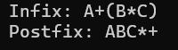

# Infix-To-Postfix-Java

This is a simple Java program that converts an **infix expression** (like `A+(B*C)`) to its **postfix equivalent** using a stack data structure.

## 📌 What is Infix and Postfix?

- **Infix Expression:** Operators are written between operands.  
  Example: `A + B`
  
- **Postfix Expression:** Operators are written after operands.  
  Example: `AB+`

### 🧠 How it works

The program:
- Reads an infix expression.
- Uses a stack to rearrange the expression according to operator precedence and parentheses.
- Outputs the postfix version of the expression.

### 📂 Files Included

- `InfixToPostfix.java` – Main Java file containing the conversion logic.

### ▶️ How to Run

1. Save the file as `InfixToPostfix.java`.
2. Open your terminal or command prompt.
3. Compile the program:
  ```bash
   javac InfixToPostfix.java
```
Run the program:
   ```bash
java InfixToPostfix
```

## 🧪 Sample Run


## ✍️ Author
**S.D.Tasuntha Chathunika** 
🎓 University of Vavuniya – Faculty of Information and Communication Technology  
📅 Date: 2025-06-09
🔗 [GitHub Profile](https://github.com/Tasuntha-Chathunika)